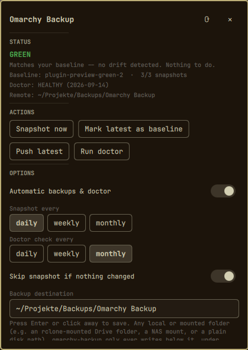

# omarchy-backup

Freeze a working Omarchy setup, notice when it drifts, and rebuild it on a
fresh install. Bash + `jq`/`zstd`/`rclone`/`tar` (all already on a stock
Omarchy box) -- no new runtime dependencies.

Security boundaries and remaining trust assumptions are documented in
[`SECURITY.md`](SECURITY.md).

## Concepts

- **Snapshot**: a named, timestamped capture of the reproducible parts of
  your workspace -- pacman/AUR packages, Omarchy plugin state, dotfiles and
  config, `~/.local/bin` scripts, systemd `--user` units, and the shared
  cross-agent knowledge (`~/.config/ai-agents`, per-agent config, and each
  project's `~/.claude/projects/*/memory`). At most **3** snapshots are kept
  at a time (see "Slot rotation" below).
- **Baseline**: one snapshot marked as "the known-good state". `status`
  diffs the live system against it.
- **Remote backup**: any snapshot can be pushed to an `rclone` remote
  (Google Drive, OneDrive, S3, SFTP, a local path, ...) for off-machine
  recovery.
- **Doctor**: a compatibility check that tells you whether this tool can
  still snapshot/diff/restore *this* Omarchy install -- see "Decay
  detection" below.

## What a snapshot contains, and what it deliberately doesn't

Declared in `~/.config/omarchy-backup/paths.conf` (defaults copied from
`config/paths.conf.default` on first run; add drop-ins under `paths.d/` for
local additions instead of editing it, so a future default update doesn't
clobber your changes). Ships with: Hyprland/Omarchy shell config, dock/theme
config, `~/.local/bin`, `~/.config/ai-agents` (the shared
Codex/Claude/Gemini knowledge base), each agent's small config files and
`~/.claude/projects/*/memory`, `mimeapps.list`/`user-dirs.dirs`, and your own
`~/.config/systemd/user/*.{service,timer,path}` unit files.

Handled separately, not via `paths.conf`:

- **Packages** (pacman explicit + AUR/foreign) and **Flatpak** apps are
  recorded as name lists, not file content -- restore reinstalls them.
- **Omarchy plugins**: a git-managed plugin (i.e. cloned via `omarchy plugin
  add`, which is how most third-party plugins arrive) is recorded as
  `{remote url, full commit SHA, uncommitted diff}` and reinstalled at exactly
  that commit (see restore step 2) -- not copied file-by-file. A plugin with
  **no** `.git` (i.e. your own, hand-written plugin) is embedded in the
  snapshot payload directly.
- **AppImages**: only detected and listed (path + checksum) for you to
  re-fetch; not embedded (they're large, redistributable binaries).

Always-on safety nets, regardless of what `paths.conf` says:

- Any file over `OB_CFG_MAX_FILE_SIZE_MB` (default 20MB) is skipped and
  listed in the manifest's `skipped_large_files` / surfaced as a manual step
  on restore.
- Anything matching a secret-shaped pattern (`*credentials*`, `*token*`,
  `*secret*`, `*.key`, `*.pem`, `id_rsa*`, `.netrc`, ...) is never embedded,
  even if a path under it was included -- listed in `skipped_secret_files`.
  Agent CLI logins (`.credentials.json`, `auth.json`, `oauth_creds.json`),
  SSH/GPG keys and browser passwords are never covered by this tool; you
  re-authenticate each tool after a restore.

## Commands

```
omarchy-backup init                              # write default config/paths (idempotent; also runs automatically)
omarchy-backup snapshot [name] [--baseline] [--replace NAME]
omarchy-backup list
omarchy-backup show <name>                       # print a snapshot's manifest.json
omarchy-backup baseline <name>                    # mark an existing snapshot as baseline
omarchy-backup status                             # GREEN / YELLOW / RED vs. the baseline
omarchy-backup push <name>                         # upload a snapshot to the configured rclone remote
omarchy-backup remote-list                         # list snapshots available on the remote
omarchy-backup pull <name>                         # download a snapshot from the remote
omarchy-backup restore <name> [--dry-run]          # pulls from remote automatically if not local
omarchy-backup doctor                              # compatibility / "decay" check
omarchy-backup timers install|status|uninstall     # systemd --user timers for automatic snapshot+doctor
omarchy-backup config list|get <KEY>|set <KEY> <VALUE>   # read/write config.conf safely (used by the bar widget)
```

Config: `~/.config/omarchy-backup/config.conf` (plain `KEY=VALUE`, see the
comments in the generated file for every option: enable/disable automatic
runs, snapshot/doctor frequency, remote name/path, retention, size cap).

## Everyday use

```bash
# after getting your system into a state you like:
omarchy-backup snapshot my-good-state --baseline
omarchy-backup push my-good-state   # if you've set OB_CFG_REMOTE_NAME

# any time later, to see if anything has drifted:
omarchy-backup status
```

`status` output:

```
Status: YELLOW (drift against baseline 'my-good-state')

Changed:
  ~/.config/hypr/

Added:
  package: foo

Removed:
  package: bar
```

- **GREEN** -- matches the baseline.
- **YELLOW** -- packages/plugins/files added, changed, or removed vs. the
  baseline.
- **RED** -- the baseline snapshot itself is missing/corrupt, or a required
  tool (`jq`/`zstd`/`tar`/`sha256sum`) is gone.

### Slot rotation

Only 3 snapshots are kept. Creating a 4th:

- interactively, asks which of the 3 to replace (never picks your baseline
  for you);
- non-interactively (a timer run, or stdin redirected from `/dev/null`),
  auto-replaces the **oldest non-baseline** snapshot and logs the decision;
- `--replace NAME` picks explicitly either way.

Snapshot names are a single path component: 1–128 ASCII letters, digits,
periods, underscores, or hyphens, starting with a letter or digit. The same
grammar is enforced for CLI arguments, local state, and remote index entries.

## Automatic backups

```bash
omarchy-backup timers install
```

Installs and enables (per `OB_CFG_ENABLED` in config.conf)
`omarchy-backup-snapshot.timer` and `omarchy-backup-doctor.timer` into
`~/.config/systemd/user/`, with `OnCalendar=` taken from
`OB_CFG_SNAPSHOT_FREQUENCY` / `OB_CFG_DOCTOR_FREQUENCY` (`daily` / `weekly` /
`monthly`, or any literal systemd `OnCalendar=` expression). Re-run `timers
install` after changing either frequency in config.conf.

- An automatic snapshot run (`snapshot --auto`) skips creating a new
  snapshot when `status` is already GREEN (`OB_CFG_SKIP_AUTO_IF_CLEAN`), and
  fires an out-of-cycle `doctor` run first if it notices Omarchy itself was
  updated since the last check (see below) -- so you're not left DEGRADED
  for a whole month after a big Omarchy update. A YELLOW state creates a
  rolling snapshot and automatically pushes it when a remote destination is
  configured. RED/UNKNOWN states are refused: repair or establish the
  known-good baseline first. A missing remote leaves the snapshot local and
  emits a warning.
- An automatic `doctor --auto` run that comes back DEGRADED sends a desktop
  notification (`notify-send`) in addition to the journal log, since a log
  line nobody reads isn't "visible" to you.

Check timer status: `omarchy-backup timers status` (wraps `systemctl --user
list-timers`). Remove them: `omarchy-backup timers uninstall`.

## Remote backup

Storage-agnostic via `rclone` -- two ways to point it somewhere, both driven
by `OB_CFG_REMOTE_PATH`:

```
# Option A: a plain local or mounted folder (an rclone-mounted Drive folder,
# a NAS mount, an external disk, ...) -- leave the remote name empty and
# make the path absolute. This is what the bar widget's destination field
# sets.
OB_CFG_REMOTE_NAME=
OB_CFG_REMOTE_PATH=/home/you/Projekte/Backups

# Option B: a raw rclone remote not mounted anywhere locally (S3, SFTP, a
# Drive remote you don't want FUSE-mounted, ...) -- CLI-only, see below.
OB_CFG_REMOTE_NAME=gdrive        # must match `rclone listremotes`
OB_CFG_REMOTE_PATH=omarchy-backup

OB_CFG_RETENTION_REMOTE=3
```

Set option B from the CLI: `omarchy-backup config set OB_CFG_REMOTE_NAME
<name>`. Whichever is set, this tool only ever calls generic `rclone
copy`/`cat`/`purge` against it -- a bare local path is just as valid an
rclone destination as `remote:path`, so both modes share 100% of the same
push/pull/retention code. Layout at the destination:

```
<remote_path>/<hostname>/
  index.json                  # lightweight listing of every pushed snapshot
  <snapshot-name>/
    manifest.json
    checksums.sha256
    payload.tar.zst
```

`push` updates `index.json` and prunes remote snapshots beyond
`OB_CFG_RETENTION_REMOTE`. The known-good baseline is always retained; the
remaining slots contain the newest rolling snapshots (the default `3` means
one baseline plus two rolling copies). Every push first validates the local
payload checksum, then runs `rclone check` after copying. A snapshot is marked
as pushed and indexed only after that comparison succeeds. `restore <name>` pulls
automatically from the remote if the snapshot isn't present locally --
that's the fresh-install path (see below).

Remote metadata is treated as untrusted input. Index reads have a 256 KiB
producer-side limit and a 20-second hard deadline; indexes are rejected unless
they contain at most 256 schema-valid entries with bounded strings and safe
snapshot names. Retention constructs every deletion beneath the configured
host backup prefix only after that validation. Other remote operations have a
15-minute hard deadline, and pulls request only the three expected snapshot
files.

Local backup configuration, state, logs, snapshot directories, and snapshot
files are kept owner-only (`0700` directories / `0600` files). Existing data is
normalized to those permissions when the CLI initializes its directories.

These checks prevent path traversal, unbounded metadata buffering, and stalled
remote operations. The current checksum design detects accidental corruption,
but is not a cryptographic authenticity proof against a storage provider that
can replace both a snapshot and its manifest. Treat the configured backup
account according to your own threat model, use its access controls/version
history, and review a remote restore with `--dry-run` when appropriate. Restore
remains an explicit user-controlled operation: the tool provides the mechanism
and evidence, while the user owns the decision to apply a self-created state.

## Restore (fresh Omarchy install -> your workspace)

```
Fresh Omarchy install
  -> install rclone, git this repo (or copy it) to ~/Projects/omarchy-backup
  -> if any of your own git-managed plugins live in a *private* repo:
     gh auth login && gh auth setup-git   (so `omarchy plugin add` can clone them)
  -> ./install.sh
  -> edit ~/.config/omarchy-backup/config.conf (set OB_CFG_REMOTE_NAME)
  -> omarchy-backup remote-list          # see what's available
  -> omarchy-backup restore <name> --dry-run   # review the plan first
  -> omarchy-backup restore <name>
```

Note: any plugin the manifest lists as git-managed (`plugins.git_managed` --
this includes not just third-party plugins but your own, once you `git
init` one) gets reinstalled via `omarchy plugin add <remote-url>` (step 2
below). If that remote is a **private** repo, the clone needs git
credentials for it -- run `gh auth login`/`gh auth setup-git` (or set up an
SSH key) before restoring, or that one step is simply skipped and reported
as a manual step at the end rather than failing the whole restore.

`restore` is staged and always dry-runnable:

1. **Packages** -- installs missing native packages (`pacman -S --needed`)
   and AUR packages (`yay`/`paru -S --needed`; noted as a manual step if
   neither is installed).
2. **Omarchy plugins** -- for each git-managed plugin, clones the recorded
   remote into a staging directory, checks out the recorded **full commit
   SHA** detached, and only then hands that staging checkout to `omarchy
   plugin add` (which runs Omarchy's own manifest validation and id checks
   and clones exactly that commit). Origin is then pointed back at the real
   remote. Any uncommitted local diff is reapplied (saved to
   `~/.local/share/omarchy-backup/restore-<id>.diff` for manual review if it
   no longer applies cleanly). Finally every previously-enabled plugin
   (built-in or third-party) is re-enabled. A plugin whose pinned commit
   cannot be found at its remote, whose recorded id/remote/commit is
   malformed, or whose repository declares a different plugin id is **neither
   installed nor enabled** -- it is listed as a manual step instead of
   silently falling back to whatever upstream's default branch contains
   today. The manifest's pin is what the snapshot promises; restore keeps
   that promise or says so.
3. **Scripts, dotfiles, themes, agent config, machine memory** -- the
   payload is extracted to `$HOME`. This one step covers `~/.local/bin`,
   Hyprland/Omarchy config, and the shared agent knowledge base +
   per-project machine memory, including recreating the
   `~/.claude/CLAUDE.md` / `~/.codex/AGENTS.md` / `~/.gemini/GEMINI.md`
   symlink triplet as symlinks (not copies).
4. **systemd user units** -- copies your unit files back, `daemon-reload`,
   then enables/starts exactly the units that were enabled/active in the
   snapshot.
5. **Symlink structure** -- a side effect of step 3 (tar preserves symlinks
   as symlinks).
6. **Integrity check** -- every restored file's checksum is re-verified
   against `checksums.sha256`.
7. **Manual steps** -- printed at the end: anything skipped as too
   large/secret at snapshot time, AppImages to re-fetch, Flatpak apps to
   reinstall, any step that failed automatically, and the standing note
   that secrets/logins are never restored automatically.

**Never silently overwrites your data**: any existing file that a restore
would change is copied aside first, as `<file>.bak.<timestamp>`, right next
to itself (the convention already used elsewhere on this machine).

### What's *not* fully automated

- Re-authenticating agent CLIs (Claude Code, Codex, Gemini/Antigravity) and
  any app with a login -- credentials are deliberately never in a snapshot.
- SSH/GPG keys, browser profiles/passwords, and anything else outside
  `paths.conf`'s declared scope.
- AppImages and Flatpak apps are only listed, not reinstalled for you.
- A plugin's uncommitted local patch that no longer applies cleanly against
  a newer upstream commit (rare, but the diff is saved for manual review).
- Cloning a git-managed plugin from a **private** repo (including one of
  your own, the moment you `git init` it) -- needs git/GitHub credentials
  set up on the fresh machine first (`gh auth login` + `gh auth setup-git`,
  or SSH keys); otherwise that one plugin is skipped and listed as a
  manual step rather than failing the whole restore.
- A git-managed plugin whose recorded commit no longer exists upstream
  (history rewritten, repository replaced) -- deliberately not installed and
  not enabled; review upstream yourself, then install manually.
- Full bit-for-bit fidelity is explicitly a non-goal; the target is "fresh
  Omarchy -> functionally the same personal workspace."

### Manual recovery without this tool

Snapshots deliberately use standard, inspectable files rather than a private
container format. `payload.tar.zst` is a Zstandard-compressed tar archive,
`manifest.json` is JSON, and `checksums.sha256` is plain text. If this project
ever disappears or stops running, recover a snapshot with stock tools:

```bash
snapshot=/path/to/snapshot-name
staging="$(mktemp -d)"

# Compare this output with: jq -r .payload.sha256 "$snapshot/manifest.json"
sha256sum "$snapshot/payload.tar.zst"

# Inspect first, then extract into an empty staging directory -- not over $HOME.
zstd -dc "$snapshot/payload.tar.zst" | tar -tf -
zstd -dc "$snapshot/payload.tar.zst" | tar -x -C "$staging"

# Verify regular files. Custom `symlink:...` records are inspected separately.
grep -v '^symlink:' "$snapshot/checksums.sha256" > "$staging-checksums.sha256"
(cd "$staging" && sha256sum -c "$staging-checksums.sha256")
grep '^symlink:' "$snapshot/checksums.sha256" || true
```

Review the extracted tree and copy back only the files you want. Package lists,
plugin remotes/commits, user-unit states, skipped files, and other reconstruction
metadata remain readable with `jq` in `manifest.json`. Automated restore is a
convenience layer over this format, not a prerequisite for accessing the data.

Backward-readable, tool-independent payloads are a format invariant. Future
authenticity metadata must be a detached sidecar and must not make manual tar
extraction depend on `omarchy-backup`.

## Protection against backup and tool decay

There are three different failure modes to defend against: a saved snapshot
can become unusable, Omarchy can evolve until the installed tool no longer
fits the system, or the local checkout of this tool can disappear. They are
handled separately.

### Backup-data decay

- The known-good baseline is never selected by automatic local slot rotation
  or remote retention. The remaining slots are replaceable rolling snapshots.
- Automatic runs save **YELLOW** drift because it may be the only recoverable
  version of a still-functioning system. They never silently promote it to the
  known-good baseline. **RED/UNKNOWN** is refused because it cannot establish a
  trustworthy recovery point.
- Every snapshot contains a manifest and SHA-256 file checksums. Before upload,
  the local payload checksum is validated; after upload, `rclone check` compares
  the remote files. Only a successful comparison marks a snapshot as pushed and
  adds it to `index.json`.
- Restore is dry-runnable and verifies restored files. Existing files are moved
  aside as `.bak.<timestamp>` before replacement. Secret-shaped and oversized
  files remain explicitly excluded and are reported as manual steps instead of
  being silently assumed safe.

These checks detect corruption and incomplete transfer; they do not prove that
the current desktop state is desirable. GREEN means “matches the selected
baseline,” and YELLOW means “drift was preserved,” not “the changed state was
approved.” A restore on a disposable VM or spare machine remains the strongest
end-to-end test.

### Tool/environment decay (`doctor`)

Omarchy's directory layout, plugin system, or package tooling can change over
time and quietly break backup or restore. `doctor` checks: Omarchy version
detected, expected directories present, plugin detection working, package
inventory working, configured paths resolving to something, machine memory
readable, the agent symlink triplet intact, this tool's own systemd units
well-formed, the remote reachable, a snapshot still creatable, the latest local
manifest well-formed, its checksum valid, and the commands `restore` depends on
(`pacman`, `git`, `systemctl`, `omarchy`) still present.

```
Omarchy version             OK
Expected directories         OK
Plugin detection             OK
Package detection            OK
Config paths                 OK
Machine memory               OK
Agent configuration          OK
systemd units                OK
Remote backup                OK
Snapshot capability           OK
Snapshot manifest            OK
Checksum validity             OK
Restore plausibility          OK

Compatibility status: HEALTHY
```

Any WARN or FAIL flips the overall status to `DEGRADED` and lists details.
Runs manually (`omarchy-backup doctor`) or on its own monthly timer (see
above); an Omarchy version change is also caught opportunistically by every
automatic snapshot run, which triggers an extra doctor pass right away
instead of waiting for the monthly one. This is a deliberately simple
mechanism (compare `pacman -Q omarchy`'s version string to the last one
seen) rather than hooking pacman itself -- a user-level tool has no clean,
non-fragile way to hook a system-level pacman transaction.

`doctor` is an early-warning compatibility probe, not a formal proof of every
restore branch. Its snapshot-capability test and latest-checksum validation
catch common silent regressions; the self-contained test suite and an occasional
real fresh-install restore cover the deeper path.

### Recovering the tool itself

Snapshots deliberately do not embed this repository checkout. The installed
`~/.local/bin/omarchy-backup` is a symlink to that checkout, so neither is an
independent rescue copy. The public GitHub repository is the canonical
off-machine copy of the program: on a fresh Omarchy installation, clone it and
run `./install.sh` first, then use `remote-list`, `pull`, or `restore` to recover
your snapshots. Keep the repository URL with your remote-storage recovery
notes, because credentials are intentionally not inside the backup.

## Bar widget (optional)

[`mst.omarchy-backup`](https://github.com/mstio/mst.omarchy-backup) is the
optional companion Omarchy shell bar-widget plugin. It is an independent UI
repository and requires this CLI on `PATH`; restore never depends on the
widget. Install it with:

```bash
omarchy plugin add https://github.com/mstio/mst.omarchy-backup.git --enable
```



It shows a status dot (colored like `status`'s GREEN/YELLOW/RED) in the bar
and opens a dialog on click with:

- **Status**: color, baseline name/snapshot count, last doctor result, remote.
- **Actions**: Snapshot now / Push latest / Run doctor (each backgrounded,
  spinner while running, result shown inline).
- **Options**: every `config.conf` key -- automatic backups on/off,
  snapshot/doctor frequency, the backup destination (a plain local/mounted
  folder path -- see below), remote retention count, and the per-file size
  cap.

Never edits config.conf directly -- every change goes through
`omarchy-backup config set`, so the CLI and the widget can never disagree
about what's valid.

**Backup destination is a plain path field, deliberately not a native
folder picker or an rclone-remote dropdown:**
- A native `QtQuick.Dialogs` `FolderDialog` was tried and **reliably crashed
  a `gdbus` helper process** in this Quickshell environment (SIGABRT inside
  GLib's GVariant D-Bus message parsing, via `coredumpctl`) the moment it
  was opened -- an environment-level Qt/portal incompatibility, not
  something fixable from plugin QML. Do not re-add a native file/folder
  dialog here without first confirming it's actually stable in *this*
  Quickshell build.
- An rclone-remote dropdown (`rclone listremotes`) plus a
  folder-within-that-remote picker was also tried and worked, but made it
  ambiguous which of "local folder" vs "remote" was actually the live
  destination when both were visible at once. Simplified back to one field.
- The path typed here is `OB_CFG_REMOTE_PATH` with `OB_CFG_REMOTE_NAME`
  empty -- i.e. exactly the "local/mounted folder" mode described above
  under Remote backup. A raw rclone remote (S3, SFTP, a Drive remote not
  mounted locally, ...) is still fully supported by the CLI/`lib/remote.sh`
  -- set it with `omarchy-backup config set OB_CFG_REMOTE_NAME <name>` --
  it just isn't exposed as a widget control; the widget shows a note when
  one is set (it takes priority over the folder field).

## Testing

```bash
tests/run-tests.sh
```

Self-contained: creates its own throwaway `$HOME`s under `mktemp -d` and a
local-directory `rclone` remote, so it never touches your real system.
Covers: init, snapshot+baseline, GREEN/YELLOW drift detection, remote
push + fresh-`$HOME` restore (this is what proves checksums are portable,
not tied to the exact `$HOME` path a snapshot was taken under), the
never-silently-overwrite backup-aside behavior, dry-run writing nothing,
`doctor` running end to end, 3-slot rotation/replacement, verified automatic
YELLOW uploads, baseline retention, corrupt-payload rejection, and failed
remote-check handling. Security regressions additionally cover rejected local
and remote traversal names, fail-closed malicious indexes, deletion-prefix
containment, remote-read deadlines, owner-only local backup permissions, and
manual extraction with stock `zstd`/`tar` tools (71 assertions total).

To actually validate a fresh-install restore for real (not just the test
suite's simulation), the most convincing check is a real spare
machine/VM: install Omarchy, run `install.sh`, `restore <name>
--dry-run` first, review it, then run it for real and compare
`omarchy-backup doctor` and a spot-check of the desktop against the
original.

## Architecture

```
bin/omarchy-backup        dispatcher, one function per subcommand
lib/common.sh             config/paths.conf loading, logging, secret-glob safety net
lib/inventory.sh          pacman/AUR/flatpak/plugin/systemd-unit inventory -> JSON
lib/manifest.sh           paths.conf -> resolved file list, checksums.sha256
lib/snapshot.sh            snapshot creation, state.json (3-slot rotation)
lib/baseline.sh             baseline marking, GREEN/YELLOW/RED drift diff
lib/remote.sh               rclone push/pull/list/retention
lib/restore.sh               staged, dry-runnable restore
lib/doctor.sh                 compatibility checks
lib/timers.sh                  systemd --user timer install/status/uninstall
config/paths.conf.default        shipped default include/exclude rules
systemd/*.service,*.timer         unit templates (@EXEC@/@ONCALENDAR_*@ placeholders)
tests/run-tests.sh                 self-contained test suite
```

State lives in `~/.local/share/omarchy-backup/`: `state.json` (slot
bookkeeping, baseline pointer, last doctor result) and
`snapshots/<name>/{manifest.json,checksums.sha256,payload.tar.zst}`.

## License

[MIT](LICENSE)
